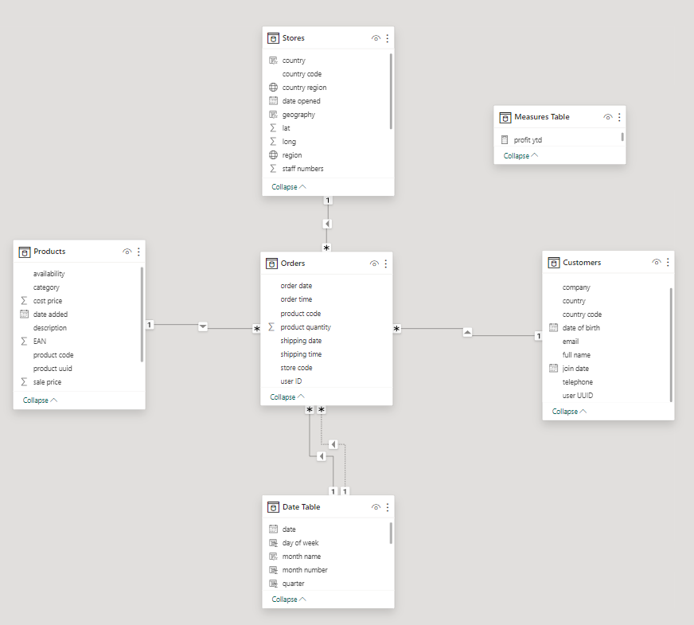
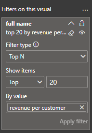
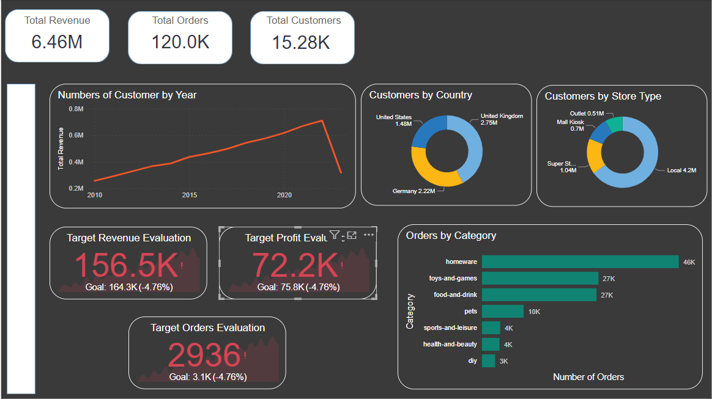
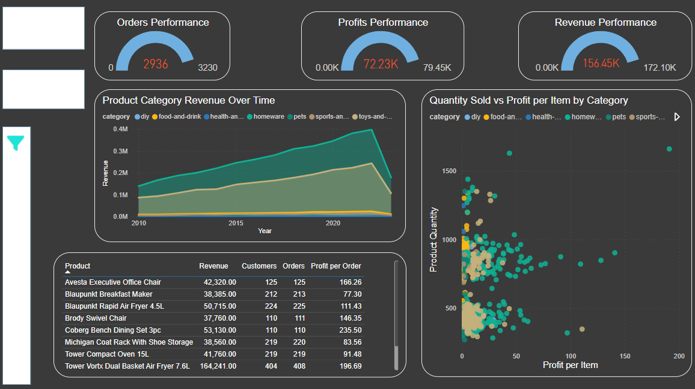
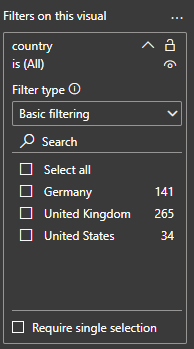
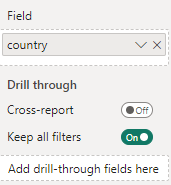
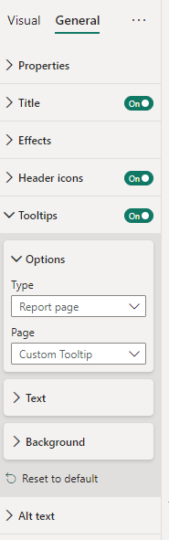
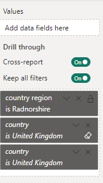
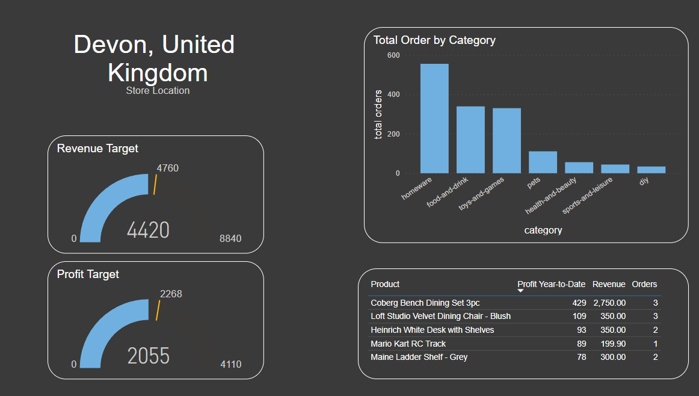
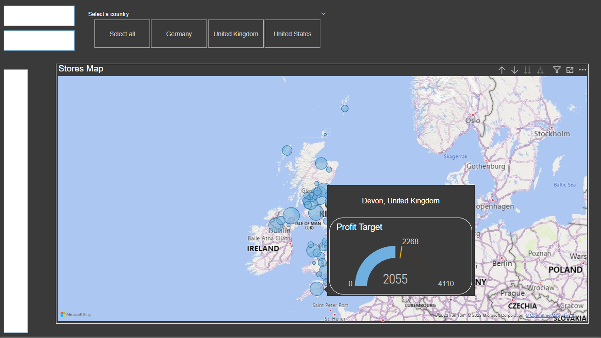

# Data Analytics in Power BI Report

In this project, I have been tasked to create a Quartely report for a (theoretical) medium-sized international retailer. The end goal for the report is to be a high-level business summary for C-suite executives, and give insights into business metrics to demonstrate current performance. 

## Requirements

- Fork this repo
- Clone this repo
- PowerBI
- SQL Tools in VSCode or similar


## Project Milestones

### Milestone One
In order to track changes, and implement reobust version control, a git repository was creeated for this project. 

### Milestone Two
This project utilises the ETL pipeline of data analytics. This stands for: extract, transform, and load. The key skills utilised in this project are:
- Importing, or extracting, data into PowerBI from different sources. Methods used were:
    1. Importing the products table from a .csv file. To do this, simply select text/csv file from the "Get data" option in the home banner. 
    2. Connecting to an SQL database to extract the orders table. To do this, select "SQL server" from the "Get data" option in the home banner. You will be prompted to enter the server name and database name (optional), followed by another prompt to ever the username and password for the desired server/database. The navigation pane will be displayed once you are connected, and from here you can select the table(s) that you want to import. 
    3. Connecting to an Azure Blob Storage container and extracting the stores table.  To do this, select "Azure Blob Storage" from the "Get data" option in the home banner. You will be prompted to enter an account name, followed by an account key. The navigation pane will be displayed once you are connected, from which you can select the container that you want to import. You should select transform data at this stage, and select "Combine" from the first column to populate the table with the data. 
    4. Importing a folder containg three .csv files and combing these to create the customers table. To do this, simply select text/csv file from the "Get data" option in the home banner and point PowerBI to the desired folder. Once the navigation pane pops up, select "Combine and transform" to generate a single table with the information from all the .csv files in your folder. 
- Transforming data in Power Query Editor to rename columns, remove null rows to ensure data integrity, deleting unnecessary columns (and those that contain sensitive data), and creating new columns based upon existing columns. 
- Loading the data into PowerBI for further analysis. 


### Milestone Three
For comprehensive analysis, a date table was generated that separates the date from the orders table into several key aspects:
- Day of Week - Generated using the `WEEKDAY()` function. 
- Month Number - Generated using the `MONTH()` function. 
- Month Name - Generated using `'Date Table'[date].[Month]`
- Quarter - Generated using the `QUARTER()` function.
- Year - Generated using the `YEAR()` function. 
- Start of Year, Quarter, Month -  Generated using `STARTOFYEAR()`, `STARTOFQUARTER()`, and `STARTOFMONTH()` respectively.
- Start of Week - Generated using `'Date Table'[date] - WEEKDAY('Date Table'[date], 2) + 1` where the weekday is taken from the date and one added to get the date for the start of the week. 


#### Star Schema
A star schema was created to define the relationships between the tables in this project. Each of these relationships is a one-to-many, single direction relationship. This means that each entry in one table, there are many matching entries in the related table. Below is a schematic of the star schema for this project. The arrows show the direction of the relationship. 



#### Measure Table
It is good practice to create a table to hold your measures. This is so that they are easily accessible and do not get lost or difficult to find in larger projects. Within this table, seven key measures were created:
1. Total orders - `COUNTROWS(Orders)` Calculates the total orders. This is a dynamic measure and will change as different filters are applied. 
2. Total revenue - `SUMX(Orders, Orders[product quantity] * RELATED(Products[sale price]))` Calculates the total revenue. 
3. Total profit - `SUMX(Orders, (RELATED(Products[sale price]) - RELATED(Products[cost price])) * Orders[product quantity])` Calcualtes the total profit.
4. Total customers - `DISTINCTCOUNT(Orders[user ID])` Calculates the total customers. 
5. Total quantity - `SUM(Orders[product quantity])` Calcualtes the total products sold. 
6. Profit year to date - `TOTALYTD([total profit], 'Date Table'[year])` Calculates the total profit for the specified year. 
7. Revenue year to date - `TOTALYTD([total revenue], 'Date Table'[year])` Calculates the total revenue for the specified year. 

#### Calculated Columns
There were several calcualted columns created at this stage also. 
1. Country in the Stores table - This was generated using an IF statement based on the country code as follows: `IF(Stores[country code] = "GB", "United Kingdom", IF(Stores[country code] = "US", "United States", "Germany"))`
2. Geography in the Stores table - This was generated by concatenating the values from the country region and country columsn as follows: `CONCATENATE(Stores[country region], CONCATENATE(", ", Stores[country]))`

### Milestone Four
Four report pages were created as follows:
1. Executive summary.
2. Customer detail.
3. Product detail.
4. Stores map.


### Milestone Five
In this milestone, the customer detail page was populated. 

1. Headline cards showing the total number of customers and the revenue per customer. 
2. Summary charts showing the customers by country (donut chart), and the customer by category (column chart). 
3. A line chart showing the total customers over time. The date hierarchy field was used for the date axis, meaning that users can drill down into the date from year -> quarter -> month. Forecasting was also used on this chart to show to projeted number of custoemrs over the next 10 periods. 
4. A table of the top 20 customers was created using a simple table. The table was set up using the customers full name, revenue and the number of orders. The "Top N" filtering method was used to specify the top 20 customers by revenue. The image below shows how this was set up in the filter pane:



5. Top customer cards were made showing the full name of the top customer, the total revenue generated by that customer and the total number of orders.
6. A date slicer was added to allow for full page filtering between specific years. 

Below is an image that shows how the report page looks overall: 

![Customer Detials Report]](image-4.png)

### Milestone Six
In this milestone, the executive summary page was populated. 

1. Three card visuals were created to show the total revenue, total orders and total profit. 
2. A line chart was created showing the revenue over time. A date hierarchy was used to allow for drill down from year, to quarter, to month. 
3. A donut charts showing the total revenue by country and store type were created. 
4. Orders by category is shown through a bar chart. 
5. Three KPI's were created to show the performance of the current quarter compared to the previous quarter. The target for orders, revenue and proft are 5% growth compared to the previous quarter. 


Below is an image that shows how the report page looks overall: 



### Milestone Seven
In this milestone, the product detail page was populated. 

1. Three guage visuals were created to show the currernt quarter performance compared to the target 10% growth on teh previous quarter. The callout value is red when the current quarter performance does not meet the 10% growth target. 
2. Revenue by product category is shown through an area chart with the date along the x axis, and total revenue on the y axis. The areas are coloured by product category. 
3. A table of the top ten products by revenue was created. 
4. Quanty sold vs profit per item was shown through a scatter plot. Again, each point was coloured by product category to show the most profitable category as well as the most profitable items.
5. Finally, a slicer toolbar was created. This allows the slicers to be hidden and therefore de-clutters the visual. To create this toolbar, it was first setup using shapes and group the slicers on top of the shape. A back button was also grouped with these. Then, bookmarks were used to show/hide the slicer toolbar. 


Below is an image that shows how the report page looks overall: 


### Milestone Eight
In this milestone, the stores map, drillthrough and custom tooltip pages were created. 

1. The stores map was generated using the geography hierarchy to allow for drillthrough. The filtering was setup to ensure that a "select all" option was available. The tooltip for this map was set to the custom tooltip page. 

    


2. The stores drillthrough page was setup to show the profit and revenue year-to-date compared to a target increase of 20% on the previous year as guages. There is a column chart to show the total orders per category, and a table shhowing the profit ytd, orders, and revenue of the top five products. This drillthrough page displays the region and country of the store being viewed. 

This is how the drillthrough was setup: 



This is how the drillthrough page looks: 



3. The custom tooltip page shows the profit guage for the store when hovered over on the map. Below is an example of how this looks:




### Milestone Nine
In this milestone, the crossfiltering and navigation between each page in the report were setup. Below is an example of the navigation bar and how the appearance of the button changes when it is hovered over:


  

Each of the navigation buttons takes the user to the associated page in the report. 

For final touches, any of the blank cards that were previously on a report page but were unused were deleted to declutter the visuals. 


### Milestone Ten 
In this milestone, a connection to the database containing the information was genereated. Several queries were run using SQL. These files are labelled question 1 - 5 and can be found in this repo in the SQL Queries folder. In this folder, there are csv files that contain the name of the tables and the columns within each table for reference. 


## Installation 

```
$ git clone https://github.com/jvrolfe/data-analytics-power-bi-report90.git
```

## Lisence

```
None
```